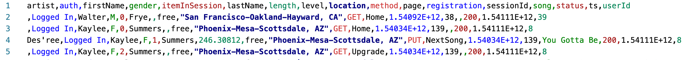

# Introduction

A startup called Sparkify wants to analyze the data they've been collecting on songs and user activity on their new music streaming app. The analysis team is particularly interested in understanding what songs users are listening to. Currently, there is no easy way to query the data to generate the results, since the data reside in a directory of CSV files on user activity on the app.

#### Dataset

>event_data/2018-11-01-events.csv
event_data/2018-11-02-events.csv

#### CSV file preview

>2018-11-01-events.csv


#### Questions to be answered

1. Give me the artist, song title and song's length in the music app history that was heard during sessionId = 338, and itemInSession = 4
2. Give me only the following: name of artist, song (sorted by itemInSession) and user (first and last name) for userid = 10, sessionid = 182
3. Give me every user name (first and last) in my music app history who listened to the song 'All Hands Against His Own'

# Solution

Data modeling should be done with Apache Cassandra and ETL pipeline using Python. ETL pipeline should transfer data from a set of CSV files within a directory to create a streamlined CSV file to model and insert data into Apache Cassandra tables.

#### Project structure

```
project
|-- event_data          # raw data
    |-- 2018-11-01-events.csv
    |-- 2018-11-02-events.csv
    |-- ...
|-- processed_data      # processed data that will be used in data modelling
    |-- event_datafile_new.csv
|-- images
    |-- Pasted_Image_2020-05-01_16_39.png
|-- README.md
|-- .gitignore
|-- Project_1B_ Project_Template.ipynb
```

#### Installing Apache Cassandra

Follow steps in this link:
[Installing Apache Cassandra](https://cassandra.apache.org/doc/latest/getting_started/installing.html)

#### Requirements

>**Python 3.6 or above**

>3rd party libraries:
pandas
numpy
cassandra-driver

```bash
    pip install pandas
    pip install numpy
    pip install cassandra-driver
```

#### Usage

Launch **Project_1B_ Project_Template.ipynb** to run every cell and check the output.